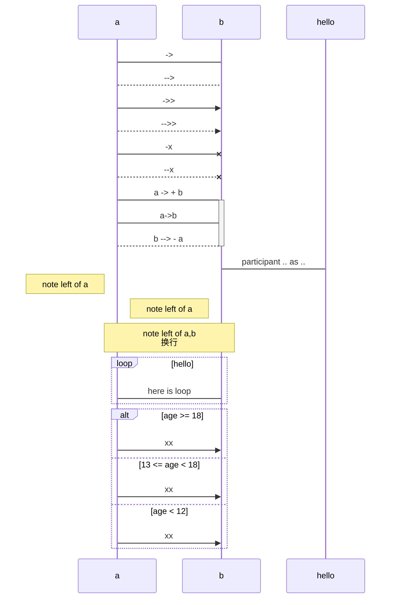

hello world

---

[toc]

### 常用

##### 列表

- hello

```
- hello
```

1. hello
2. world

```
1. hello
2. world
```

##### 删除线

~~这一句划掉~~

```
~~这一句划掉~~
```

##### 高亮

==这里高亮==

```
==这里高亮==
```

##### 代码块

`hello`

```
`hello`
```

三个```

~~~
```java
class User{}
```
~~~

##### todoList

- [ ] hello
- [x] world

```markdown
- [ ] hello
- [x] world
```

##### 引用

> hello

```
> hello
```

##### 表格

太复杂了，懒得敲，直接用typora快捷键 `ctrl t`

|      |      |      |
| ---- | ---- | ---- |
|      |      |      |
|      |      |      |
|      |      |      |

##### 目录

```
[toc]
```

---

### 复杂

##### 流程图

```flow
st=>start: 闹钟响起
op=>operation: 与床板分离
cond=>condition: 分离成功?
e=>end: 快乐的一天

st->op->cond
cond(yes)->e
cond(no)->op
```

##### 时序图

```sequence
aa->bb:hello
cc->bb:hello
note right of dd:damn
```




##### 公式

> todo：markdown公式